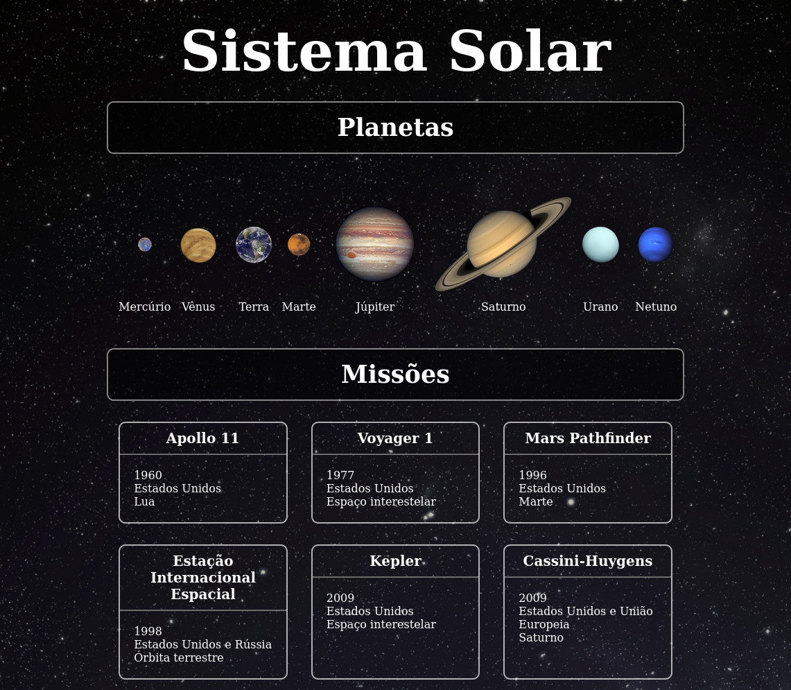

# Sobre o Projeto 

  <a href="https://davidrogger.github.io/trybe-project-solar-system">
    
    <i>Clique na imagem acessar a página online<>
  </a>

- Essa seção, foi iniciada a apresentação do react, onde foi apontado o porque de sua criação pelo facebook, o facebook se tornou-se muito complexo e de difícil manutenção com seu crescimento, sendo necessário a criação de uma solução de escalabilidade, dando inicio então a era do react.
- O projeto foi o mais simples de todos do modulo, abordando apenas como usar o react, entender o que é JSX e como escrever os componentes. Foi usado arquivos simulando o uso de uma API, para renderização em lista, nomes, imagens e descrições de planetas.

# Tecnologias e ferramentas usadas 🛠

-

# Desafios

- 
# Conclusão

- 

  

    <strong>
      ⚠️ Configurações mínimas para execução do projeto
    </strong>
  

   - Sistema Operacional Distribuição Unix
 - Python versão >= 3.8.10 

  

    <strong>
      :newspaper_roll: Requisitos solicitados durante o desenvolvimento do projeto
    </strong>
  

 
### Resultado por requisito
*Nome* | *Avaliação*
--- | :---:
1 - lore | :heavy_check_mark:

