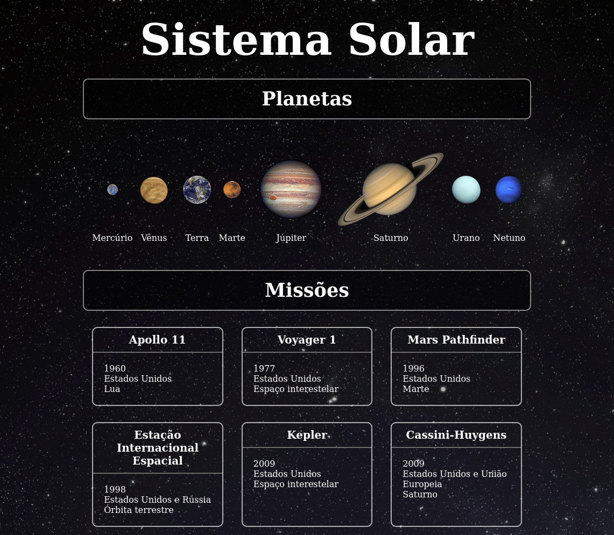
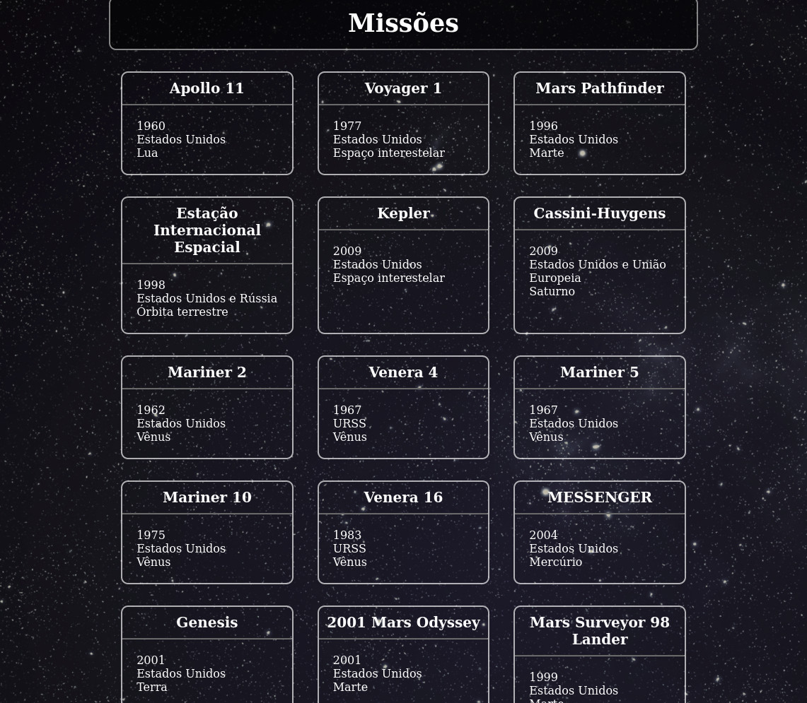
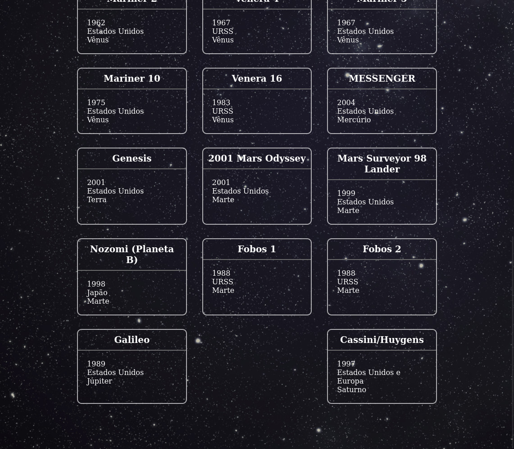

# Sobre

## Seção: `Introdução ao React`
- Essa seção, foi iniciada a apresentação do react, onde foi apontado o porquê de sua criação pelo Facebook, com o aumento de usuários, sua complexidade e dificuldades de manutenção aumentaram junto, sendo necessário a criação de uma solução de escalabilidade, dando início então ao react. Sua instalação, e inicialização, abordando o entendimento do que é JSX e como ele funciona, criação de componentes, uso de props.
#

  

>*clique na imagem para acesso online do projeto*
#
## Projeto: `Solar System`
- O projeto foi o mais simples de todos do módulo. Foi usado arquivos simulando o uso de uma API, para renderização em lista, nomes, imagens e descrições de planetas. Criando componentes modelo para cards, títulos e divisões.

# Tecnologias e ferramentas usadas 🛠

# Desafios

- Entender a mistura do *hyper text* do *HTML* com *javascript*, tornando mais simples e prática a renderização de uma lista de itens.

# Conclusão

- Reproduzir esse projeto usando *javascript* puro, seria muito mais trabalhoso e bagunçado para identificar cada parte do código, a componentização e mescla do código *javascript* com o *HTML* usando *JSX*, facilita bem a compreensão depois de alguns experimentos.

  

    <strong>
      ⚠️ Configurações mínimas para execução do projeto
    </strong>
  

   - Sistema Operacional Distribuição Unix
 - Python versão >= 3.8.10 

  

    <strong>
      :newspaper_roll: Requisitos solicitados durante o desenvolvimento do projeto
    </strong>
  

 
### Resultado por requisito
*Nome* | *Avaliação*
--- | :---:
1 - lore | :heavy_check_mark:

